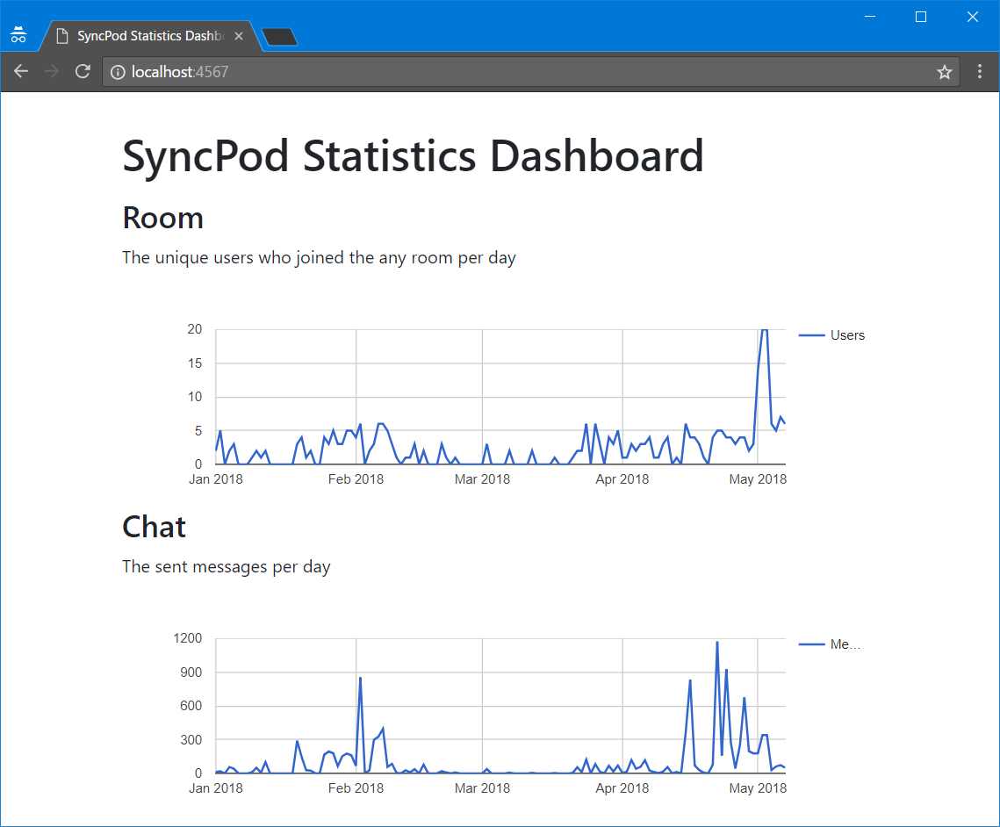

# SyncPod-dashboard
A minimum implementation of dashboard of SyncPod

## How to launch

0. clone this repository
0. run `bundle install --path vendor/bundle` to install dependencies
0. `cp .env.example .env` and write your appropriate environment variables
0. `bundle exec rackup`

